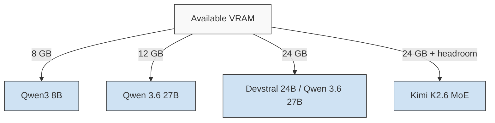

AI coding tools went from autocomplete to autonomous agents in two years, and 2026's landscape is crowded: Claude Code, Codex CLI, OpenCode, Aider, Gemini CLI, Goose — each a "harness" that reads your repo, plans changes, edits files, and runs commands. Then there's MCP (Model Context Protocol), now the Linux-Foundation-governed standard that wires all of them into GitHub, databases, and browsers. And underneath everything, local models via Ollama mean your code never has to leave the machine.

The good news for Shanios users: every one of these tools is userland software. They install into `~/.local/bin` or Distrobox, keep their state in dotfiles under `$HOME`, and never touch the immutable root. An OS update cannot break your agent setup, and rolling back an update cannot lose it.

---

## The Harness Landscape

| Harness | Why people pick it |
|---|---|
| **Claude Code** | Most polished agent loop; plan mode; sub-agents; rated most-loved harness in JetBrains' April 2026 developer survey |
| **Codex CLI** | Fast (Rust); open source; custom providers via TOML |
| **OpenCode** | MIT-licensed; most provider choice (75+); clean TUI; great with local models |
| **aider** | Git-native — commits every change, so history stays reviewable and revertible |
| **Gemini CLI** | Generous free tier; Google ecosystem; Plan Mode |
| **Goose** | Block's open-source agent; multi-provider |
| **Kilo CLI** | Terminal sibling of the Kilo Code editor extension (below), itself forked from OpenCode — same MCP marketplace and 400+-model routing in a terminal shell |
| **Pi** | The deliberate anti-bloat pick — ships the model just four tools (read/write/edit/bash) and a sub-1,000-token system prompt; MIT, embeddable as an SDK |
| **OpenHands** | MIT, 80k+ GitHub stars — self-hosted, runs sandboxed in a container; note its dedicated CLI is no longer actively maintained, so follow the project's current official run instructions rather than an old tutorial's |
| **Amp** | Sourcegraph's harness (CLI + VS Code extension) — pay-as-you-go with zero markup over provider pricing, free tier with no hard token cap |
| **Open Interpreter** | `pip install open-interpreter` then run `interpreter` — 65k+ GitHub stars, MIT, strong local-model story, edits documents/spreadsheets alongside code |

Install example — OpenCode lands in your home directory and survives everything:

```bash
curl -fsSL https://opencode.ai/install | bash
```

The ecosystem's collective wisdom applies here: the harness shapes workflow, but the model decides output quality. Pick ergonomics first, then route to whatever backend fits your budget.

**Where the market actually stands (2026):** GitHub Copilot leads on raw share (~40%, Microsoft/enterprise-bundling driven), but Claude Code — despite being newer — already carries more workplace adoption than Cursor and was rated the single most-loved tool in JetBrains' most recent developer survey. Cursor remains the fastest-growing, at 5M+ active users. By raw GitHub stars, OpenCode is the most-starred open harness (~199k), with OpenHands, Gemini CLI, and Codex CLI clustered in the same tier. The honest takeaway from the data: most developers don't pick one and stop — the average professional now runs 2.3 AI coding tools side by side, routing routine work to whichever is cheapest and hard problems to whichever is best that week.

**Not a harness, but worth knowing:** [Warp](https://warp.dev) is an AI-native terminal (full native Linux support since 2024, client dual-licensed MIT/AGPLv3 as of 2026) whose "Oz" feature can launch and drive Claude Code, Codex CLI, or Warp's own agent from one place — a way to manage several harnesses without switching windows, rather than a harness itself.

---

## Cheap Brains: DeepSeek and Friends

Harnesses are free; you pay per token — and every harness speaks the OpenAI-compatible dialect, so providers are interchangeable. Point aider, OpenCode, or Codex CLI at any hosted API (DeepSeek, GLM, Kimi, Qwen, OpenAI, Anthropic-compatible routers) with two environment variables:

```bash
export OPENAI_API_BASE=https://api.deepseek.com   # example — swap for any provider
export OPENAI_API_KEY=sk-...
```

GLM, Kimi, and Qwen work identically. Prefer zero data egress? Pull local weights instead:

```bash
podman run -d --name ollama -p 11434:11434 --device /dev/dri \
  -v ~/.ollama:/root/.ollama docker.io/ollama/ollama

podman exec ollama ollama pull deepseek-coder-v2:16b
aider --model ollama/deepseek-coder-v2:16b
```

AMD and Intel GPUs pass through with just `/dev/dri`; NVIDIA needs the container toolkit that ships pre-installed. Model storage lives under `@home`, so downloads survive updates and rollbacks untouched.

Not sure which models fit your hardware? [llm-checker](https://github.com/signerless/llm-checker) scans your RAM/VRAM/CPU and hands you ranked recommendations with ready-to-paste `ollama pull` commands — plus an MCP mode so your coding agent can check hardware fit itself:

```bash
llm-checker recommend --category coding
```

And since virtually every open model lives on Hugging Face, the local stack consumes it directly — Ollama pulls GGUF repos straight from the Hub (`ollama pull hf.co/...`), llama.cpp loads them at launch with `-hf`, vLLM serves any repo ID, and weights cache to `~/.cache/huggingface` under `@home`. Their Inference Providers add yet another OpenAI-compatible free tier to the stack.

---

## Zero-Cost Inference Is Real in 2026

You can run this entire workflow without paying for tokens:

**OpenCode Zen** — OpenCode's curated gateway ships rotating free models (community and vendor-promo coding models) selectable straight from the model picker. One honest caveat: some free-period models train on collected data, so keep proprietary code on paid or local routes.

**Kilo Gateway** — Kilo Code's own equivalent: 40+ free coding models (ByteDance Seed, Grok Code Fast, NVIDIA Nemotron, Arcee Trinity, and others), available with zero config to both signed-in and anonymous users — anonymous use is rate-limited to 200 requests/hour per IP. Same rotation caveat as Zen applies: check the live list before assuming a specific model is still there.

**The tools themselves also give away free usage, separately from free models.** A few worth knowing specifically: Google Jules gives 15 fully autonomous agent tasks a day, free, no card. GitHub Copilot's free tier (2,000 completions + 50 chats/month) is the one genuinely *permanent* entry on this list — everything else here is a trial, a rate limit, or subject to change. Zed's Personal plan is free forever for BYOK/local models, no restriction at all — only Zed's own hosted models need the paid tier. And if you maintain a real open-source project, Anthropic's "Claude for Open Source" program gives qualifying maintainers six months of the $200/mo Max 20x tier for nothing. Codex CLI, Cursor, Devin Desktop, Gemini CLI, JetBrains Junie, Amp, and OpenHands all have some free allowance too — smaller and more likely to shift, so check current numbers before planning around them.

**Permanent free tiers** — Google AI Studio (Gemini Flash with 1M context), Groq (fastest inference on open models), Cerebras (~1M tokens/day), NVIDIA NIM (100+ hosted open models), Mistral's Experiment tier (huge monthly budget incl. Codestral), GitHub Models (frontier-class via your GitHub account), and OpenRouter's 30+ `:free` models behind a single key. All OpenAI-compatible, all work with every harness above:

```bash
export OPENAI_API_BASE=https://api.groq.com/openai/v1   # example
export OPENAI_API_KEY=gsk_...
aider --model openai/llama-3.3-70b-versatile
```

**Stacking** — since each provider's rate limits are independent, many developers run several free keys through OpenRouter or a self-hosted LiteLLM proxy and let failover do the rest.

Set expectations honestly: free tiers throttle mid-task and never include frontier weights. They're superb for boilerplate, tests, and learning — and when you outgrow them, upgrading is a two-line change because nothing about your setup is locked to any provider.

---

## AI-Native Editors and Agent-First Extensions

Terminal harnesses aren't the only style in 2026 — a parallel track of AI-native editors builds the agent into the IDE itself:

| Editor | What it is | Linux install |
|---|---|---|
| **Cursor** | VS Code fork with the deepest first-party agent integration; free tier up to a $200/mo Max tier | AppImage (needs `libfuse2` on fresh Ubuntu) |
| **Devin Desktop** (formerly Windsurf) | Cognition acquired and rebranded Windsurf in June 2026 after the OpenAI-acquisition deal collapsed and Google licensed its founders; Pro is now $20/mo flat, replacing per-message token-credit billing | AppImage — prefer a distro `.deb`/`.rpm` where offered for auto-updates |
| **Zed** | Rust-based, GPU-accelerated editor; its Agent Panel speaks the open Agent Client Protocol (ACP), so it can drive Claude, GPT, Gemini, local Ollama models, *or* an external CLI like Claude Code/Codex/OpenCode from inside one chat panel, including multiple parallel agents | Native binary; ships its own edit-prediction model (Zeta2) |
| **Kilo Code** | VS Code/JetBrains extension, Apache-2.0, forked from the Cline→Roo Code lineage (Roo Code itself was archived in May 2026); MCP server marketplace, 400+ models via BYOK, free-vs-paid via a credit "Kilo Pass" | Marketplace on VS Code; **Open VSX** for VSCodium and other non-Microsoft builds |
| **JetBrains Junie** | JetBrains' own first-party agent (GA June 2026), distinct from Continue/Cody; ships a standalone CLI too, for terminal/CI use | Plugin across the whole JetBrains lineup — all Flathub-installable on Shanios; priced into JetBrains AI Pro/Ultimate |

Cursor and Devin Desktop both ship as Linux AppImages rather than distro packages, which fits Shanios' philosophy exactly: an AppImage runs from anywhere in `@home` without touching the immutable root. Kilo Code, being a plain extension, just inherits whatever sandbox your editor already runs in — including a Flatpak VS Code/VSCodium install, where it's distributed via Open VSX.

---

## MCP: Give Your Agent Hands

MCP solved the N×M integration problem — one protocol, any client, any tool. Since its Linux Foundation handover, adoption exploded: thousands of public servers, official first-party integrations from GitHub, Stripe, Linear, Cloudflare, and Notion.

For developers, three picks earn their config lines immediately:

1. **GitHub MCP server** — issues and PRs without leaving the agent loop
2. **Context7** — injects current library docs at prompt time, cutting stale-API hallucinations dramatically
3. **Filesystem/Git reference servers** — scoped repo access

```json
{
  "mcpServers": {
    "context7": { "command": "npx", "args": ["-y", "@upstash/context7-mcp"] }
  }
}
```

One security note worth repeating: prefer first-party servers, pin versions, and treat random registry finds like curl-piped shell scripts — because functionally, that's what they are.

---

## Review, Not Just Generation

2026's other shift: AI reviewing code, not writing it. CodeRabbit and Qodo lead the SaaS tier. If you'd rather self-host, PR-Agent runs as a plain container:

```bash
podman run --rm -e OPENAI_KEY=$OPENAI_API_KEY \
  -e CONFIG.GIT_PROVIDER=github \
  docker.io/codiumai/pr-agent:latest \
  --pr_url=https://github.com/you/repo/pull/123 review
```

Or skip the tooling entirely — today's harnesses review diffs on request with no extra infrastructure.

---

## Four More Shifts Worth Knowing

**Context engineering** — 2026's named successor to "prompt engineering," specifically for agentic coding. The discipline isn't the prompt anymore, it's the whole information environment an agent sees: which files, which rules, which history, which tools. The converged practical rule — a clean, small context with a weaker model consistently beats a cluttered, huge context with a stronger one. Teams doing this well structure their context files as short bullet rules plus explicit `## Preferred` / `## Avoid` blocks with real code samples, and stamp them with freshness metadata (`last_updated`, `owner`, `scope`) so an agent can judge whether a rule still applies.

**AGENTS.md** — the open standard for telling every agent about your project: build commands, conventions, no-gos. One file at the repo root, read natively by Claude Code, Codex, OpenCode, Cursor, and Copilot alike. Governed under the Linux Foundation; 60k+ repos already ship one.

**Spec-driven development** — the industry's correction to vibe coding. GitHub's Spec Kit (Specify → Plan → Tasks → Implement) and AWS Kiro formalize it, but Markdown discipline is enough: requirements.md → design.md → numbered agent-sized tasks.md, then implement one task per prompt.

**Async cloud agents** — Copilot coding agent (assign an issue, get a draft PR), Google Jules (free daily task tier), Codex cloud, Cursor cloud agents. Delegate routine tickets to a cloud VM while your local harness handles design work. They open ordinary PRs, so Shanios needs nothing special on the receiving end — review the diff, not the summary.

---

## Model Cheat Sheet (July 2026)

| Use Case | Model | VRAM (Q4) |
|---|---|---|
| Best overall (MoE) | Kimi K2.6 | ~19 GB |
| Best dense 27B | Qwen 3.6 27B | 22 GB |
| Best agentic 24B | Devstral Small 24B | 14 GB |
| Best FIM autocomplete | Codestral 22B | 14 GB |
| Best 8 GB VRAM | Qwen3 8B | 5 GB |
| Reasoning-heavy | DeepSeek-R1 14B/32B | 10/20 GB |

8 GB → Qwen3 8B; 12 GB → Qwen 3.6 27B; 24 GB → Devstral 24B; max quality → Kimi K2.6 quantized.

### Model Selection Decision Framework



**If branching to multiple users:** Kimi K2.6 MoE offers the best per-token quality but requires ~19 GB VRAM for Q4. For shared or multi-user setups, Qwen 3.6 27B provides the best consistent reasoning at 22 GB. Devstral 24B excels at multi-file editing loops. Qwen3 8B is the practical floor for daily coding assistance.

**Quantization quick-reference:** Q4_K_M is the sweet spot — preserves ~80% of original quality at roughly half the VRAM of Q5_XXL. Q3_K_S is viable for 6 GB systems. Avoid Q2_K for code tasks (excessive hallucinations).

---

## Sandboxing Your Agents

Don't run autonomous agents on your bare OS. On Shanios:

- Single-user: rootless Podman + `--security-opt no-new-privileges` + gVisor (`runsc`) for LLM-generated code
- GPU workloads: gVisor (has GPU support) or full VM
- Always snapshot before long autonomous runs: `sudo btrfs subvolume snapshot /var/lib/libvirt /snapshots/pre-agent-$(date +%s)`

---

## Python & Node Quick-Reference (July 2026)

| Task | Tool | Shanios Pattern |
|---|---|---|
| **Python venv** | `python3 -m venv .venv` | Create inside `~/venvs/` under `@home`; `pip install -r requirements.txt` |
| **Faster venv** | `uv venv .venv` | ~5x faster than pip; `uv pip install -r requirements.txt` |
| **Python deps** | `poetry install` | Declarative `pyproject.toml`; locks reproduce exact env |
| **Node nvm** | `nvm install 22` | Store `~/.nvm` in `@home`; works inside Distrobox |
| **Node fnm** | `fnm install 22` | Single binary; no shell profile changes |
| **Node package manager** | `pnpm install` | Recommended for modern projects; fast, disk-efficient |
| **Nix profile node** | `nix-env -iA nixpkgs.nodejs_22` | Installs to Nix profile; survives rollbacks |
| **Java JDK** | `nix-env -iA nixpkgs.openjdk_17` | Installs to Nix profile; `~/.java` in `@home`; survives rollbacks |
| **Java SDKMAN** | `sdk install java 17` | SDKMAN; `~/.sdkman` in `@home`; single binary, no profile pollution |
| **Java Distrobox** | `distrobox create --name java-dev --image ubuntu:24.04` then `apt install openjdk-17-jdk` | Full Ubuntu env; `~/.java` in `@home`; good for AUR-prohibited setups |

---

## The Immutable Advantage

Why does Shanios suit this workflow particularly well?

- **Nothing to break**: agents edit files in `@home`; the root stays read-only. A misbehaving agent literally cannot damage the OS.
- **Snapshot before you delegate**: take a Btrfs snapshot before a big autonomous run; revert instantly if the result disappoints.
- **State persists safely**: sessions, configs, model weights, MCP configs — all in `$HOME`, all surviving every update and rollback.
- **Privacy by architecture**: zero telemetry plus fully-local Ollama means code can stay on-device end to end.

Full command-level detail: [AI-Assisted Development](https://docs.shani.dev/doc/software/ai-development).

---

## Resources

- [Development Environments](https://docs.shani.dev/doc/software/development) — toolchain strategy foundation
- [GPU Containers](https://docs.shani.dev/doc/software/gpu-containers) — NVIDIA/AMD compute in Podman
- [Podman Containers](https://shani.dev/post/podman-containers-on-shani-os) — container fundamentals
- [Distrobox](https://shani.dev/post/distrobox-on-shani-os) — running Node-based CLIs
- [OpenCode](https://opencode.ai) · [Aider](https://aider.chat) · [MCP](https://modelcontextprotocol.io)
- [Kilo Code](https://kilo.ai) · [Pi](https://github.com/earendil-works/pi) · [Cursor](https://cursor.com) · [Devin Desktop](https://devin.ai) · [Zed](https://zed.dev)
- [OpenHands](https://docs.all-hands.dev) · [Amp](https://ampcode.com) · [JetBrains Junie](https://www.jetbrains.com/junie) · [Warp](https://warp.dev) · [Open Interpreter](https://github.com/KillianLucas/open-interpreter)
